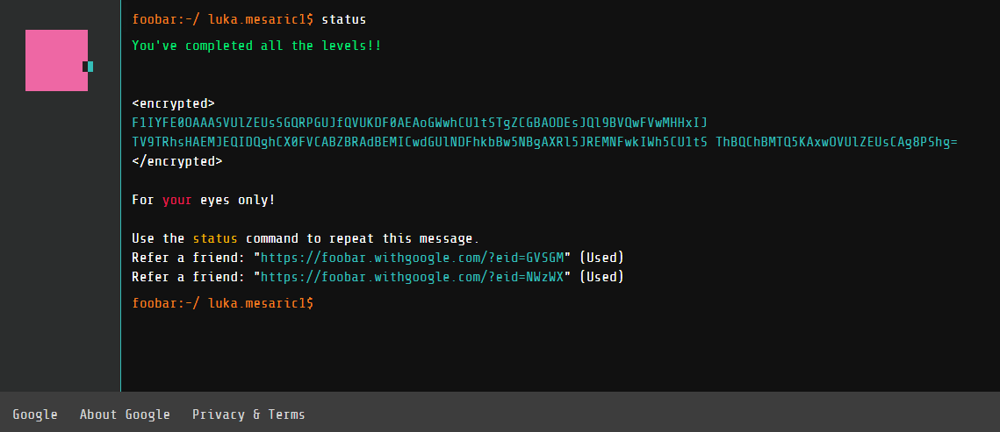

# Google's Foobar Challenge

My solutions to all five levels of **Google's Foobar Challenge** in Python (September 2020).

 

 

[Journal](Lore/journal.md)  
[Decrypted message](Lore/decode.py)

## Level 1
- [The cake is not a lie!](Level%201/the-cake-is-not-a-lie)

## Level 2
- [Lovely Lucky LAMBs](Level%202/lovely-lucky-lambs)
- [Please Pass the Coded Messages](Level%202/please-pass-the-coded-messages)

## Level 3
- [Bomb, Baby!](Level%203/bomb-baby)
- [Prepare the Bunnies' Escape](Level%203/prepare-the-bunnies-escape)
- [The Grandest Staircase Of Them All](Level%203/the-grandest-staircase-of-them-all)

## Level 4
- [Free the Bunny Prisoners](Level%204/free-the-bunny-prisoners)
- [Running with Bunnies](Level%204/running-with-bunnies)

## Level 5
- [Expanding Nebula](Level%205/expanding-nebula)
- [Dodge the Lasers!](Level%205/dodge-the-lasers)
